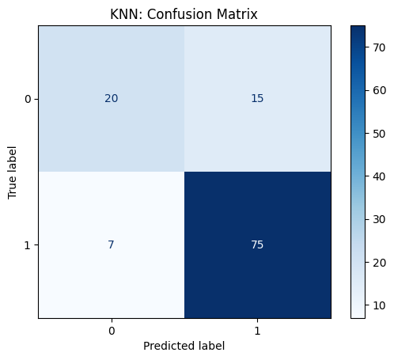

# Credit Risk Classification | [View Code](https://github.com/Matsalak-Viktoria/Credit-Risk-Classification/blob/main/Credit_Risk_Classification.ipynb)

## Overview
This project explores the implementation and evaluation of a machine learning pipeline for credit risk classification using the Credit Risk dataset.

The main goal of the project is not only to build classification models for predicting loan approval decisions, but also to compare the performance of Logistic Regression, Naive Bayes, Decision Tree, and K-Nearest Neighbors (KNN) using data preprocessing, outlier detection, and hyperparameter tuning.

The project focuses on the following prediction task:
- Credit Risk Classification - Predicting whether a loan application will be approved or rejected based on applicants' demographic, financial, and credit history information.

## Objectives
The main objectives of this project are:
- Perform Exploratory Data Analysis (EDA) to understand feature distributions and relationships with the target variable.
- Build and evaluate a machine learning pipeline for credit risk classification using the Credit Risk dataset.
- Analyze the experimental results by comparing the performance of Logistic Regression, Naive Bayes, Decision Tree, and K-Nearest Neighbors (KNN) to identify the most effective classification model.

## Dataset
- **Loan ID**: Unique identifier of the loan application in the database, assigned automatically by the system.
- **Gender**: Applicant's gender. Possible values: **Male**, **Female**.
- **Married**: Applicant's marital status. Possible values: **Yes**, **No**.
- **Dependents**: Number of the applicant's dependents. Possible values: **0**, **1**, **2**, **3+**.
- **Education**: Applicant's education level. Possible values: **Graduate**, **Not Graduate**.
- **Self_Employed**: Indicates whether the applicant is self-employed. Possible values: **Yes**, **No**.
- **ApplicantIncome**: Applicant's average monthly income (USD).
- **CoapplicantIncome**: Co-applicant's (spouse's) average monthly income (USD).
- **LoanAmount**: Requested loan amount (thousand USD).
- **Loan_Amount_Term**: Loan term (months).
- **Credit_History**: Indicates whether the applicant has a previous credit history. Possible values: **Yes**, **No**.
- **Property_Area**: Property location category. Possible values: **Urban**, **Semiurban**, **Rural**.
- **Loan_Status**: Final loan application decision. Possible values: **Y** (Approved), **N** (Rejected).

## Workflow
The project workflow includes:
1. Exploratory Data Analysis (EDA)  
2. Logistic Regression Training and Evaluation
   - Preprocessing Pipeline Setup (for Outlier Detection)
   - Data Preprocessing (Imputation, Scaling)
   - Outlier Detection with Isolation Forest
   - Train/Test Split
   - Model Training Pipeline Setup
   - Cross-Validation with GridSearchCV
     - Data Preprocessing (Imputation, Encoding, Scaling)
     - Logistic Regression Model Training
     - Best Hyperparameter Selection
   - Prediction on Unseen Test Data
   - Model Evaluation
3. Naive Bayes Training and Evaluation
   - Same steps as for Logistic Regression
4. Decision Tree Training and Evaluation
   - Same steps as for Logistic Regression
5. KNN Training and Evaluation
   - Same steps as for Logistic Regression
6. Result Analysis
   - Comparison of Model Performance
   - Selection of the Most Effective Classification Model

## Technologies
- Python
- Pandas
- NumPy
- Scikit-learn
- Matplotlib
- Seaborn

## Methods
### Data Preprocessing
**For Outlier Detection**:
- Missing value imputation (Median)
- Feature scaling (StandardScaler)

**For Model Training**:

**Numerical features**:
- Missing value imputation (Median)
- Feature scaling (StandardScaler)

**Categorical features**:
- Missing value imputation (Most Frequent)
- One-Hot Encoding

### Outlier Detection
- Isolation Forest

### Machine Learning Models
- Logistic Regression
- Gaussian Naive Bayes
- Decision Tree
- K-Nearest Neighbors (KNN)

**Hyperparameters optimized**:
- Logistic Regression: Regularization strength (C)
- Decision Tree: Maximum tree depth (max_depth)
- K-Nearest Neighbors (KNN): Number of neighbors (n_neighbors)

### Validation Strategy
**Train/Test Split + GridSearchCV**:
- Train/Test split for final model evaluation
- GridSearchCV with 5-Fold Cross-Validation for hyperparameter optimization

### Model Evaluation
**Metrics**:
- Accuracy
- Precision
- Recall
- F1-score

**Visualization**:
- Confusion Matrix

## Results
### Model Performance Comparison for Each Experiment:
### Logistic Regression Experiment:

```text
Evaluation on the test set:
              precision    recall  f1-score   support

    Rejected       0.83      0.57      0.68        35
    Approved       0.84      0.95      0.89        82

    accuracy                           0.84       117
   macro avg       0.84      0.76      0.78       117
weighted avg       0.84      0.84      0.83       117
```


### Naive Bayes Experiment:

```text
Evaluation on the test set:
              precision    recall  f1-score   support

    Rejected       0.86      0.54      0.67        35
    Approved       0.83      0.96      0.89        82

    accuracy                           0.84       117
   macro avg       0.85      0.75      0.78       117
weighted avg       0.84      0.84      0.83       117
```


### Decision Tree Experiment:

```text
Evaluation on the test set:
              precision    recall  f1-score   support

    Rejected       0.86      0.54      0.67        35
    Approved       0.83      0.96      0.89        82

    accuracy                           0.84       117
   macro avg       0.85      0.75      0.78       117
weighted avg       0.84      0.84      0.83       117
```


### KNN experiment:

```text
Evaluation on the test set:
              precision    recall  f1-score   support

    Rejected       0.74      0.57      0.65        35
    Approved       0.83      0.91      0.87        82

    accuracy                           0.81       117
   macro avg       0.79      0.74      0.76       117
weighted avg       0.81      0.81      0.80       117
```



### Model performance comparison:
Based on the obtained results, it can be concluded that all evaluated algorithms achieved a similar level of accuracy (0.81 and 0.84). However, they differ in their decision-making behavior.

**Logistic Regression** demonstrated a tendency to predict the positive class ("Approved") more frequently, as indicated by the considerably higher Recall for the "Approved" class (0.95) compared to the "Rejected" class (0.57). At the same time, similar Precision values for both classes (0.83 and 0.84) indicate consistent prediction quality and the absence of significant bias in prediction accuracy.

**Naive Bayes** and **Decision Tree** produced identical results across all evaluation metrics. This can be explained by the shallow tree structure (max_depth = 2), whose decision-making logic closely resembles the probabilistic approach of Naive Bayes. Both models primarily rely on a single dominant feature, Credit_History, resulting in similar behavior and predictive performance. They successfully identify the positive class ("Approved"), while showing lower performance in detecting rejected applications, which is likely due to the class imbalance in the dataset.

The **K-Nearest Neighbors (KNN)** algorithm achieved slightly lower accuracy (0.81), which is likely due to the combined effect of class imbalance and the selected number of neighbors, making the model more sensitive to noise in the data. Nevertheless, the model maintained an acceptable level of accuracy. Similar to Logistic Regression, KNN also exhibited a tendency to predict the positive class ("Approved") more frequently, as evidenced by the substantially higher Recall for the "Approved" class (0.91) compared to the "Rejected" class (0.57).

Overall, Logistic Regression demonstrated the best balance between Precision and Recall among all evaluated models. It maintained high Precision for both classes while providing satisfactory detection of the minority "Rejected" class, indicating stable and reliable performance even in the presence of class imbalance.
